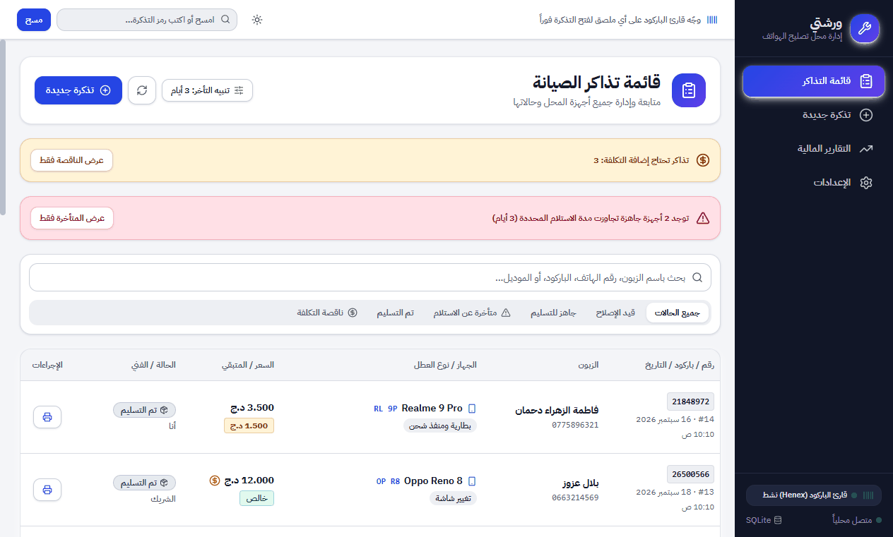
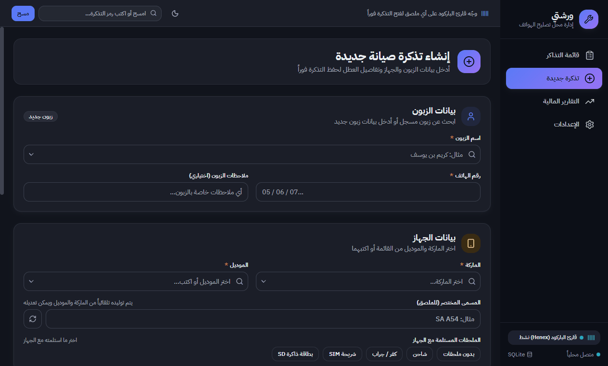
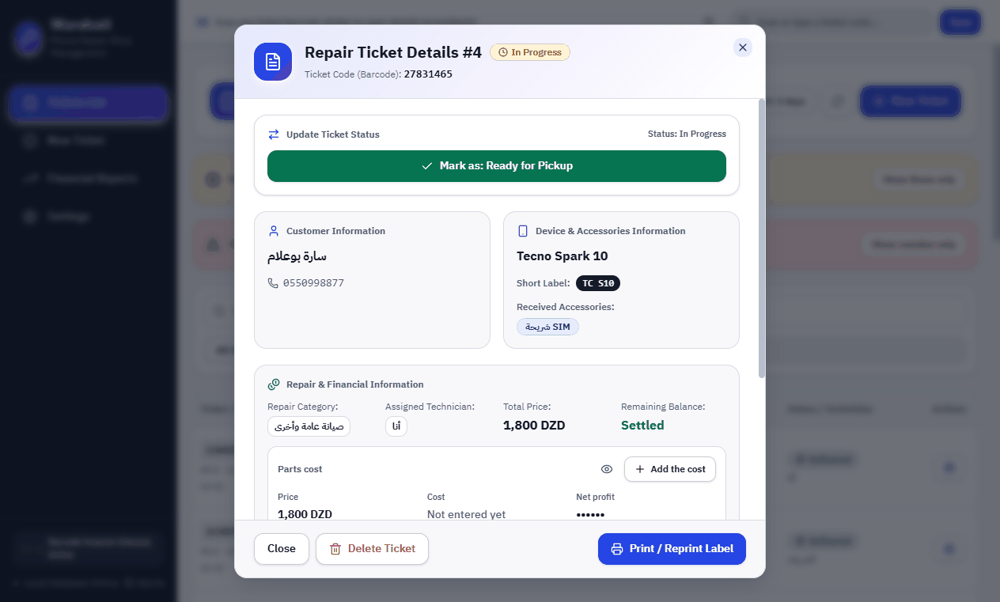
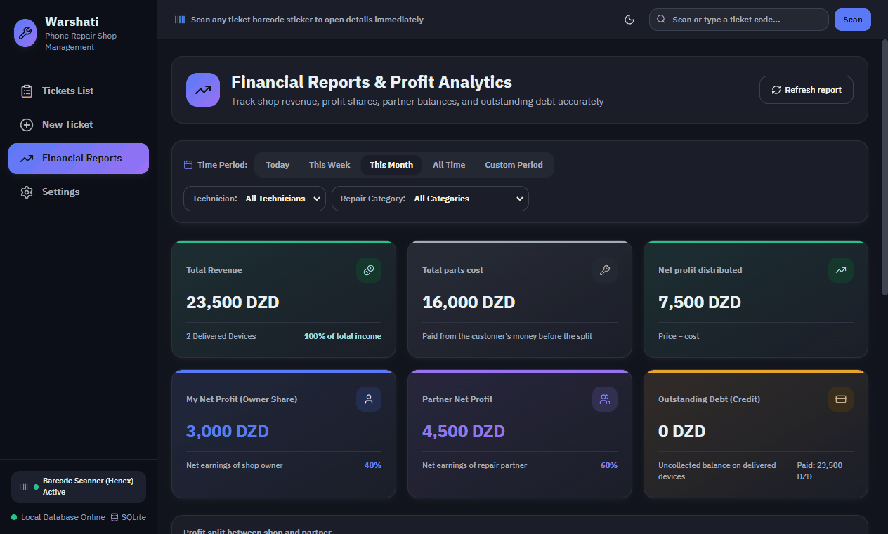
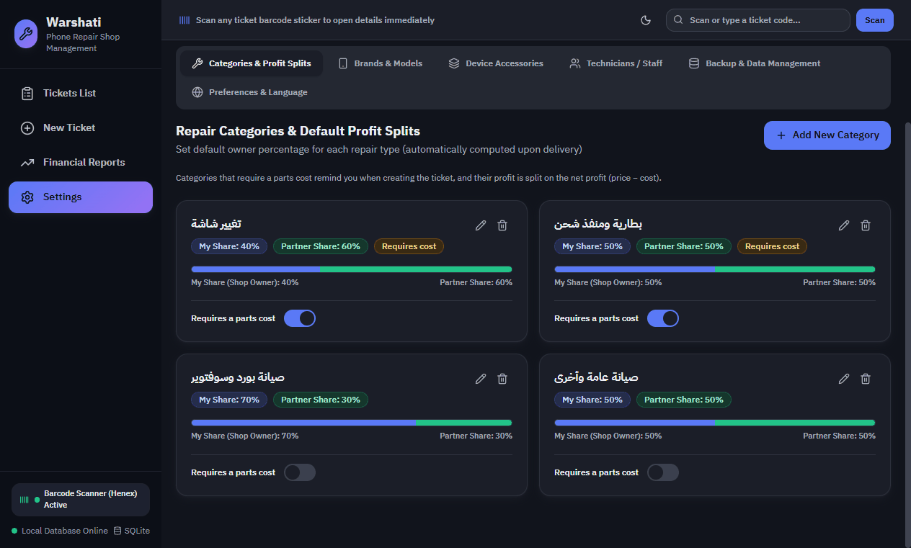
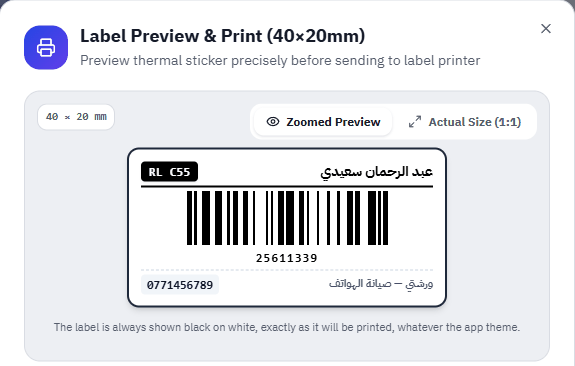
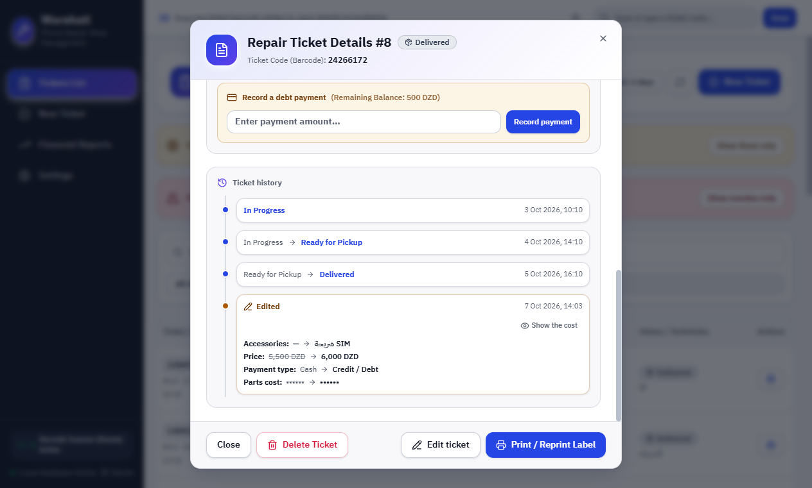

<p align="center">
  
</p>

<h1 align="center">ورشتي · Warshati</h1>

<p align="center">
  برنامج سطح مكتب لإدارة محل تصليح الهواتف، يعمل بلا إنترنت<br>
  An offline desktop app for running a phone repair shop
</p>

<p align="center">
  <a href="https://github.com/fateh-beddiaf/warshati/actions/workflows/ci.yml"></a>
  <a href="LICENSE"></a>
</p>

<p align="center"><a href="#english">English below ⬇</a></p>

<p align="center">
  
  
</p>

<div dir="rtl">

## ما هو ورشتي؟

ورشتي برنامج لمحلات تصليح الهواتف. يتتبع كل هاتف من لحظة استلامه حتى تسليمه، ويطبع له ملصق باركود يُلصق عليه. يحسب أيضاً ربح كل تذكرة وحصة كل شريك. يعمل بالكامل على جهاز المحل: **لا إنترنت، لا حساب، لا اشتراك**، وبيانات المحل لا تغادر الكمبيوتر.

- **تذاكر صيانة بباركود:** الزبون، الجهاز (ماركة وموديل باقتراحات فورية)، العطل، السعر، والفني. الملصق 40×20mm فيه اسم الزبون والجهاز والرمز. عند عودة الزبون يكفي مسح الملصق لتفتح تذكرته من أي شاشة.
- **الملحقات المستلمة** (غطاء، شريحة، شاحن...) تُسجَّل بنقرة، فلا خلاف عند التسليم.
- **الحالة:** قيد الإصلاح ← جاهز ← تم التسليم، وكل تغيير مؤرَّخ. التذاكر الجاهزة المتأخرة تظهر بتنبيه.
- **تعديل التذاكر مع سجل التعديلات:** ما أُدخل خطأً يُصحَّح بعد الإنشاء: الزبون، الجهاز، الملحقات، التصنيف، الفني، السعر، المدفوع، وتكلفة القطعة. كل تعديل يُسجَّل في سجل التذكرة (القيمة القديمة والجديدة ووقت التعديل)، وتعديل تذكرة مسلَّمة يُراجَع قبل الحفظ ويعيد حساب حصص أرباحها.
- **الدفع:** نقداً أو ديناً مع عربون، وتسديد الباقي لاحقاً. نوع الدفع يُحدَّد تلقائياً: نقداً إن لم يبقَ شيء، وديناً إن بقي جزء.
- **تصنيفات الأعطال ونسب الأرباح:** لكل تصنيف نسبة تقسيم بينك وبين الشريك، تُجمَّد عند التسليم.
- **تكلفة القطع:** الربح الصافي = السعر − تكلفة القطعة. التكلفة **لا تظهر للزبون أبداً**: ليست على الملصق، ومخفية في الشاشة حتى تنقر لإظهارها.
- **الشريك:** إن كان هو الفني فالربح الصافي كله له.
- **التقارير:** الدخل وحصة كل شريك لكل فترة، حسب الفني وحسب التصنيف، مع الديون.
- **نسخ احتياطي تلقائي** إلى مجلد تختاره، مع تصدير واستيراد يدوي.
- **عربي / English**، ووضع **فاتح / مظلم**.

قاعدة حساب الأرباح كاملة في [`src/shared/profit.ts`](src/shared/profit.ts).

## الترخيص: مجاني للاستخدام غير التجاري

ورشتي **متاح المصدر (source-available)**، وليس "مفتوح المصدر" بتعريف [OSI](https://opensource.org/osd). يمكنك قراءة الكود وتعديله، لكن حسب شروط [PolyForm Noncommercial 1.0.0](LICENSE):

- **مجاني** للاستخدام الشخصي والتعليمي، وللهواة، وللجمعيات والمؤسسات غير الربحية.
- **أي استخدام في نشاط تجاري يتطلب إذناً مكتوباً من المالك، بما فيه محلات التصليح** التي تستعمله في عملها. اطلب الإذن عبر [فتح Issue](https://github.com/fateh-beddiaf/warshati/issues/new?template=commercial_use.yml) أو من [صفحة المالك على GitHub](https://github.com/fateh-beddiaf).

النص القانوني الملزم هو ملف [LICENSE](LICENSE)، وهذا القسم تبسيط له فقط.

## التثبيت

1. نزّل `Warshati-Setup-<الإصدار>-x64.exe` من صفحة [Releases](https://github.com/fateh-beddiaf/warshati/releases)، وتحقق إن شئت من بصمته في `SHA256SUMS.txt`.
2. شغّله. المثبّت **غير موقّع رقمياً** (التوقيع يحتاج شهادة مدفوعة)، لذلك قد تظهر نافذة Windows SmartScreen الزرقاء تقول إن Windows حمى الكمبيوتر (Windows protected your PC). اضغط **مزيد من المعلومات (More info)** ثم **تشغيل على أي حال (Run anyway)**.
3. التثبيت للمستخدم الحالي فقط، ولا يطلب صلاحيات المدير. يمكنك تغيير مجلد التثبيت، ويُنشأ اختصار على سطح المكتب وفي قائمة ابدأ.

**البيانات** محفوظة في `%APPDATA%\Warshati` (الملف `warshati.db`). **إلغاء التثبيت لا يحذفها.**

### أول شيء بعد التثبيت: النسخ الاحتياطي التلقائي

كل بيانات المحل على قرص واحد، وإن تلف ضاعت. افتح **الإعدادات ← النسخ الاحتياطي والبيانات**، واختر مجلداً على **فلاشة USB** أو قرص آخر، ثم فعّل النسخ التلقائي. يحفظ البرنامج نسخة عند الإغلاق، وكل 24 ساعة على الأكثر، إن تغيّر شيء. وما دامت البيانات بلا نسخة يبقى تنبيه ظاهر أعلى الشاشة.

لنقل البيانات إلى جهاز آخر: **تصدير نسخة احتياطية** من الجهاز القديم، ثم **استيراد** في الجديد.

## العتاد

| الجهاز       | المطلوب                                                                                          |
| ------------ | ------------------------------------------------------------------------------------------------ |
| طابعة ملصقات | حرارية **203 DPI**، ملصقات **40×20mm** (مُختبرة: **Xprinter XP-350B**)                           |
| قارئ باركود  | **USB بنمط لوحة المفاتيح (HID)**، مضبوط ليضيف Enter بعد كل مسح (الإعداد الافتراضي لأغلب القرّاء) |

- **القارئ:** لا يحتاج تعريفاً ولا إعداداً في البرنامج. للتحقق منه افتح **الإعدادات ← التفضيلات واللغة ← اختبار القارئ** وامسح أي باركود: ستعرف ما يرسله القارئ بالضبط، وهل يتعرّف عليه البرنامج كمسح.
- **الطابعة:** اخترها مرة في نافذة الطباعة، فيتذكرها البرنامج. إن خرجت أشرطة الباركود باهتة، فارفع **Darkness / الكثافة** من إعدادات درايفر الطابعة (خصائص الطابعة ← تفضيلات الطباعة). وإن خرجت سميكة أو ملتصقة فخفّفها.

## للمطورين

راجع قسم [Development](#development) بالإنجليزية أدناه.

</div>

---

<a id="english"></a>

## What is Warshati?

Warshati is a Windows desktop app for phone repair shops. It tracks every phone from drop-off to pick-up and prints a barcode label to stick on it. It also works out each ticket's profit and each partner's share. Everything runs on the shop's computer: **no internet, no account, no subscription**, and the shop's data never leaves the machine. The interface is Arabic first, with full English.

- **Barcode repair tickets:** customer, device (brand and model with type-ahead), fault, price and technician. The 40×20 mm label carries the customer, the device and the code. When the customer comes back, scanning the label opens the ticket from any screen.
- **Accessories left with the phone** (case, SIM, charger…) are recorded in one click, so there is no dispute at pick-up.
- **Status:** in progress → ready → delivered, every change timestamped. Ready tickets left too long are flagged.
- **Ticket editing with an edit history:** fix anything entered by mistake after creation: customer, device, accessories, category, technician, price, amount paid and parts cost. Every edit is recorded in the ticket's history (old value, new value and time), and editing a delivered ticket is reviewed before saving and recalculates its profit shares.
- **Payment:** cash, or credit with a deposit and the rest paid later. The type is set automatically: cash when nothing is left to pay, credit when part of the amount remains.
- **Repair categories and profit splits:** each category has its own split between you and your partner, frozen at delivery.
- **Parts cost:** net profit = price − parts cost. The cost is **never shown to the customer**: it is not on the label, and the app hides it until you click to show it.
- **Partner:** when the partner did the repair, the whole net profit is theirs.
- **Reports:** income and each partner's share per period, by technician and by category, with debts.
- **Automatic backups** to a folder you choose, plus manual export and import.
- **Arabic / English**, **light / dark** theme.

<p align="center">
  
  
</p>
<p align="center">
  
  
</p>
<p align="center">
  
</p>

## License: free for noncommercial use

Warshati is **source-available**, not "open source" as the [OSI](https://opensource.org/osd) defines it. You may read and change the code under the [PolyForm Noncommercial License 1.0.0](LICENSE):

- **Free** for personal, educational and hobby use, and for charities and other noncommercial organizations.
- **Any use in a business needs written permission from the owner, repair shops using it for their work included.** Ask by [opening an issue](https://github.com/fateh-beddiaf/warshati/issues/new?template=commercial_use.yml) or through the [owner's GitHub profile](https://github.com/fateh-beddiaf).

The [LICENSE](LICENSE) file is the binding text; this section only summarizes it.

## Install

1. Download `Warshati-Setup-<version>-x64.exe` from [Releases](https://github.com/fateh-beddiaf/warshati/releases). You can check it against `SHA256SUMS.txt`.
2. Run it. The installer is **not code-signed** (that needs a paid certificate), so Windows SmartScreen may say "Windows protected your PC": click **More info** → **Run anyway**.
3. It installs for the current user only, without administrator rights. You can change the install folder. It adds a desktop and a Start menu shortcut.

**Your data** lives in `%APPDATA%\Warshati` (the file `warshati.db`). **Uninstalling does not delete it.**

### First thing after installing: automatic backups

All the shop's data is on one disk; if it fails, the data is gone. Open **Settings → Backup & Data Management**, choose a folder on a **USB drive** or another disk, and turn automatic backups on. The app saves a copy when it closes, and at most every 24 hours, whenever something changed. A banner stays at the top of the screen while the data has no backup.

To move to another computer: **export a backup** on the old one, then **import** it on the new one.

## Hardware

| Device          | What works                                                                                       |
| --------------- | ------------------------------------------------------------------------------------------------ |
| Label printer   | Thermal, **203 DPI**, **40×20 mm** labels (tested: **Xprinter XP-350B**)                         |
| Barcode scanner | **USB in keyboard mode (HID)**, set to send Enter after each scan (the default on most scanners) |

- **Scanner:** no driver and nothing to set up in the app. To check it, open **Settings → Preferences & Language → Scanner test** and scan any barcode: you see exactly what the scanner sends and whether the app recognizes it as a scan.
- **Printer:** choose it once in the print dialog and the app remembers it. If the bars come out faint, raise **Darkness** in the printer driver (Printer properties → Printing preferences). If they come out thick or run together, lower it.

## Development

Requirements: Windows, and Node.js at the version in [`.nvmrc`](.nvmrc) (with npm). No C++ toolchain is needed: `better-sqlite3` ships a prebuilt binary.

```bash
npm ci              # install, download Electron, check better-sqlite3 loads in it
npm run dev         # run the app with hot reload (database in ./data)
npm run verify      # lint, format check, typecheck, UI rules, unit tests
npm run test:e2e    # build, then end-to-end tests on the real Electron app (Playwright)
npm run dist        # build the Windows installer into release/
npm run test:packaged  # smoke test of the packaged app in release/win-unpacked (after dist)
```

Set `WARSHATI_DATA_DIR` to a scratch folder to run the app on separate data (the tests always do).

| Folder         | Contents                                                                                                             |
| -------------- | -------------------------------------------------------------------------------------------------------------------- |
| `src/main`     | Electron main process: window, security policy, IPC, printing, backups                                               |
| `src/preload`  | The `window.api` bridge between the UI and the main process                                                          |
| `src/renderer` | React UI (screens, components, Arabic/English strings in `lib/locales`)                                              |
| `src/database` | SQLite schema, migrations, seed data and queries                                                                     |
| `src/shared`   | Code shared by both sides: types, the profit rule, ticket codes, label barcode                                       |
| `tests`        | Unit tests (`*.test.ts`), Electron end-to-end tests (`tests/e2e`) and the packaged-app smoke test (`tests/packaged`) |
| `build`        | App icon (`icon.svg` is the source: `npm run icons` renders the `.png` and `.ico`)                                   |

The profit rule, the most important logic in the app, is in [`src/shared/profit.ts`](src/shared/profit.ts) and is covered by its own unit tests.

Releases: pushing a `v*` tag runs every check, builds the installer and opens a draft GitHub release with the installer and `SHA256SUMS.txt` (see [`.github/workflows/release.yml`](.github/workflows/release.yml)). Security reports: see [SECURITY.md](SECURITY.md). Changes: [CHANGELOG.md](CHANGELOG.md).
